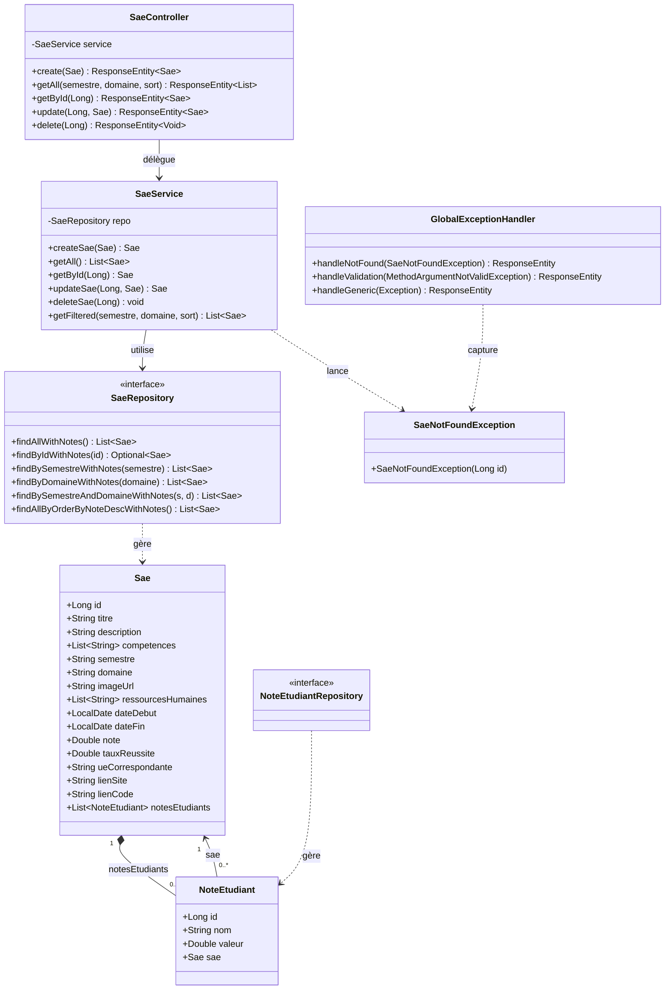

# SAÉ Manager — Dossier de Conception

## Table des matières

1. [Présentation du projet](#1-présentation-du-projet)
2. [Architecture globale](#2-architecture-globale)
3. [Architecture backend en couches](#3-architecture-backend-en-couches)
4. [Diagramme de classes](#4-diagramme-de-classes)
5. [Modèle Entité-Relation](#5-modèle-entité-relation)
6. [API REST — Référence des endpoints](#6-api-rest--référence-des-endpoints)
7. [Architecture frontend](#7-architecture-frontend)
8. [Navigation et flux utilisateur](#8-navigation-et-flux-utilisateur)
9. [Diagrammes de séquence](#9-diagrammes-de-séquence)
10. [Gestion des erreurs](#10-gestion-des-erreurs)

---

## 1. Présentation du projet

**SAÉ Manager** est une application mobile full-stack destinée au département MMI permettant de consulter et gérer les Situations d'Apprentissage Évaluées (SAÉ). Elle affiche pour chaque SAÉ les notes des étudiants, les compétences associées, les ressources humaines, et les liens vers les productions.

| Dimension | Choix technologique | Justification |
|-----------|--------------------|----|
| Backend | Spring Boot 3 + Java 17 | Robustesse, architecture en couches éprouvée, injection de dépendances |
| Base de données | H2 (en mémoire) | Portable, zéro configuration pour la démo/correcteur |
| ORM | JPA / Hibernate + Lombok | Mapping objet-relationnel automatique, réduction du code boilerplate |
| Frontend | React Native + Expo | Code unique iOS/Android/Web, hot-reload, distribution via Expo Go |
| Navigation | React Navigation v7 | Standard de facto pour React Native |
| Client HTTP | Axios | Intercepteurs, timeout, gestion d'erreurs centralisée |

---

## 2. Architecture globale

L'application suit une architecture **client-serveur** découplée. Le frontend et le backend communiquent exclusivement via une API REST en JSON sur le port 8080.

```
┌─────────────────────────────────────────────────────────────┐
│                    APPAREIL MOBILE / WEB                    │
│                                                             │
│   ┌─────────────────────────────────────────────────────┐   │
│   │               APPLICATION REACT NATIVE              │   │
│   │                                                     │   │
│   │   HomeScreen ──────► SaeDetailsScreen               │   │
│   │       │                                             │   │
│   │   SaeCard (composant)                               │   │
│   │       │                                             │   │
│   │   api.js (Axios)                                    │   │
│   └─────────────────┬───────────────────────────────────┘   │
└─────────────────────│───────────────────────────────────────┘
                      │  HTTP/JSON (port 8080)
                      │  GET /api/saes
                      │  POST /api/saes
                      │  PUT /api/saes/{id}
                      │  DELETE /api/saes/{id}
                      │
┌─────────────────────┴───────────────────────────────────────┐
│                    SERVEUR SPRING BOOT                      │
│                                                             │
│   SaeController  ──►  SaeService  ──►  SaeRepository        │
│                                            │                │
│                                       Base H2 (mémoire)     │
│                                       ┌──────────────┐      │
│                                       │  SAE         │      │
│                                       │  NOTE_ETU    │      │
│                                       └──────────────┘      │
└─────────────────────────────────────────────────────────────┘
```

---

## 3. Architecture backend en couches

Le backend applique le pattern **n-tiers** (Controller → Service → Repository → Model), garantissant la séparation des responsabilités.

```
┌────────────────────────────────────────────────────────┐
│  COUCHE PRÉSENTATION  (controllers/)                   │
│  SaeController                                         │
│  • Reçoit les requêtes HTTP                            │
│  • Valide les données (@Valid)                         │
│  • Délègue au Service                                  │
│  • Retourne des ResponseEntity<T>                      │
├────────────────────────────────────────────────────────┤
│  COUCHE MÉTIER  (services/)                            │
│  SaeService                                            │
│  • Contient la logique applicative                     │
│  • Gère les filtres (semestre, domaine, tri)           │
│  • Lance les exceptions métier (SaeNotFoundException)  │
├────────────────────────────────────────────────────────┤
│  COUCHE ACCÈS DONNÉES  (repositories/)                 │
│  SaeRepository  |  NoteEtudiantRepository              │
│  • Étend JpaRepository<T, ID>                         │
│  • Requêtes JPQL avec JOIN FETCH (anti N+1)            │
│  • Méthodes nommées Spring Data                        │
├────────────────────────────────────────────────────────┤
│  COUCHE MODÈLE  (models/)                              │
│  Sae  |  NoteEtudiant                                  │
│  • Entités JPA mappées sur la base H2                  │
│  • Annotations de validation (@NotBlank)               │
│  • Lombok @Data (getters/setters auto)                 │
├────────────────────────────────────────────────────────┤
│  COUCHE TRANSVERSALE  (exceptions/)                    │
│  GlobalExceptionHandler  |  SaeNotFoundException       │
│  • @RestControllerAdvice : capture toutes les erreurs  │
│  • Retourne des réponses JSON structurées              │
└────────────────────────────────────────────────────────┘
```

### Flux d'une requête HTTP dans le backend

```
Requête HTTP
     │
     ▼
@RestController (SaeController)
  • Deserialisation JSON → objet Java
  • Validation @Valid (si POST/PUT)
     │
     ▼
@Service (SaeService)
  • Logique métier (filtrage, vérification existence)
  • Lance SaeNotFoundException si introuvable
     │
     ▼
@Repository (SaeRepository)
  • Requête SQL générée par Hibernate
  • JOIN FETCH pour charger les notes en une requête
     │
     ▼
Base de données H2 (mémoire)
     │
     ▼ (retour)
SaeService → SaeController
  • Sérialisation objet → JSON
  • Wrapping dans ResponseEntity (code HTTP)
     │
     ▼
Réponse HTTP JSON
```

---

## 4. Diagramme de classes



---

## 5. Modèle Entité-Relation

Deux tables sont persistées en base H2. Les listes de chaînes (`competences`, `ressourcesHumaines`) sont stockées dans des tables de jointure séparées générées automatiquement par JPA (`@ElementCollection`).

```
┌─────────────────────────────────────────────────────────┐
│                         SAE                             │
├──────────────────┬──────────────────────────────────────┤
│ id               │ BIGINT (PK, auto-increment)          │
│ titre            │ VARCHAR NOT NULL                     │
│ description      │ TEXT                                 │
│ semestre         │ VARCHAR (ex: "S3", "S5")             │
│ domaine          │ VARCHAR (ex: "Web", "Design")        │
│ image_url        │ VARCHAR                              │
│ date_debut       │ DATE                                 │
│ date_fin         │ DATE                                 │
│ note             │ DOUBLE                               │
│ taux_reussite    │ DOUBLE                               │
│ ue_correspondante│ VARCHAR                              │
│ lien_site        │ VARCHAR                              │
│ lien_code        │ VARCHAR                              │
└──────────────────┴──────────────────────────────────────┘
           │ 1
           │
           │ N
┌─────────────────────────────────────────────────────────┐
│                     NOTE_ETUDIANT                       │
├──────────────────┬──────────────────────────────────────┤
│ id               │ BIGINT (PK, auto-increment)          │
│ nom              │ VARCHAR NOT NULL                     │
│ valeur           │ DOUBLE (nullable = pas de note)      │
│ sae_id           │ BIGINT (FK → SAE.id)                 │
└──────────────────┴──────────────────────────────────────┘

Tables générées automatiquement par @ElementCollection :
┌─────────────────────────────────────────────────────────┐
│              SAE_COMPETENCES                            │
│  sae_id (FK) │ competences (VARCHAR)                   │
├─────────────────────────────────────────────────────────┤
│              SAE_RESSOURCES_HUMAINES                    │
│  sae_id (FK) │ ressources_humaines (VARCHAR)            │
└─────────────────────────────────────────────────────────┘
```

### Cardinalités

| Relation | Type | Description |
|----------|------|-------------|
| SAE → NoteEtudiant | `1..N` | Une SAÉ possède de zéro à plusieurs notes d'étudiants |
| NoteEtudiant → SAE | `N..1` | Une note appartient à exactement une SAÉ |
| SAE → competences | `1..N` | Une SAÉ est liée à plusieurs compétences (chaînes) |
| SAE → ressourcesHumaines | `1..N` | Une SAÉ est liée à plusieurs membres d'équipe |

---

## 6. API REST — Référence des endpoints

**Base URL :** `http://<host>:8080/api`

| Méthode | Endpoint | Description | Corps requête | Réponse succès |
|---------|----------|-------------|---------------|----------------|
| `GET` | `/saes` | Liste toutes les SAÉ (avec filtres optionnels) | — | `200 OK` + `List<Sae>` |
| `GET` | `/saes?semestre=S3` | Filtre par semestre | — | `200 OK` + `List<Sae>` |
| `GET` | `/saes?domaine=Web` | Filtre par domaine | — | `200 OK` + `List<Sae>` |
| `GET` | `/saes?sortByNoteDesc=true` | Tri décroissant par note | — | `200 OK` + `List<Sae>` |
| `GET` | `/saes/{id}` | Détail d'une SAÉ par ID | — | `200 OK` + `Sae` |
| `POST` | `/saes` | Crée une nouvelle SAÉ | `Sae` (JSON) | `201 Created` + `Sae` |
| `PUT` | `/saes/{id}` | Met à jour une SAÉ existante | `Sae` (JSON) | `200 OK` + `Sae` |
| `DELETE` | `/saes/{id}` | Supprime une SAÉ | — | `204 No Content` |

### Codes d'erreur

| Code HTTP | Situation |
|-----------|-----------|
| `400 Bad Request` | Corps JSON invalide (champ `titre` manquant ou vide) |
| `404 Not Found` | SAÉ introuvable avec l'ID demandé |
| `500 Internal Server Error` | Erreur interne inattendue |

### Exemple de réponse `GET /saes`

```json
[
  {
    "id": 1,
    "titre": "SAE 501",
    "description": "Projet SAE 501 - Notes des étudiants",
    "semestre": "S5",
    "domaine": null,
    "imageUrl": null,
    "note": null,
    "notesEtudiants": [
      { "id": 1, "nom": "ETU-501-001", "valeur": 10.05 },
      { "id": 2, "nom": "ETU-501-002", "valeur": 13.05 }
    ]
  }
]
```

---

## 7. Architecture frontend

### Structure des fichiers

```
frontend/
├── App.js                        # Point d'entrée, configuration navigation
├── index.js                      # Bootstrap Expo
├── app.json                      # Métadonnées Expo
├── package.json
└── src/
    ├── api/
    │   └── api.js                # Client Axios (baseURL, timeout, intercepteurs)
    ├── components/
    │   └── SaeCard.js            # Composant carte réutilisable
    ├── screens/
    │   ├── HomeScreen.js         # Liste des SAÉ
    │   └── SaeDetailsScreen.js   # Détail + notes étudiants
    └── theme/
        └── colors.js             # Palette de couleurs centralisée
```

### Rôle de chaque fichier

| Fichier | Responsabilité |
|---------|---------------|
| `App.js` | Configure le `NavigationContainer` et le `Stack.Navigator` |
| `api.js` | Instancie Axios avec la baseURL selon la plateforme, timeout 10s, log des erreurs |
| `colors.js` | Source unique de vérité pour toutes les couleurs de l'UI |
| `SaeCard.js` | Composant de présentation pur (pas de logique, reçoit tout via props) |
| `HomeScreen.js` | Écran liste : fetch API, états loading/error, FlatList |
| `SaeDetailsScreen.js` | Écran détail : affiche les champs d'une SAÉ et la FlatList des notes |

### Détection de la plateforme dans `api.js`

La baseURL s'adapte automatiquement à l'environnement d'exécution :

```
Platform.OS === 'web'      →  http://localhost:8080/api
Platform.OS === 'android'  →  http://10.0.2.2:8080/api   (émulateur Android)
iOS / appareil physique    →  http://<EXPO_GO_HOST>:8080/api
```

> `10.0.2.2` est l'alias réseau d'Android Studio qui redirige vers `localhost` de la machine hôte.

---

## 8. Navigation et flux utilisateur

L'application utilise un **Stack Navigator** (navigation empilée) de React Navigation v7.

```
NavigationContainer
    │
    └── Stack.Navigator
            │
            ├── Screen: "Home" ──────────────► HomeScreen
            │       title: "Gestion SAÉ MMI"         │
            │                                         │ onPress(SaeCard)
            │                                         │ navigate("SaeDetails", { sae })
            │                                         ▼
            └── Screen: "SaeDetails" ──────► SaeDetailsScreen
                    title: "Détails SAÉ"
```

### Diagramme de navigation

```
┌─────────────────────────────────────┐
│            HomeScreen               │
│                                     │
│  ┌──────────────────────────────┐   │
│  │  SaeCard (SAE 501)           │   │──► tap ──► SaeDetailsScreen
│  └──────────────────────────────┘   │            (sae = SAE 501)
│  ┌──────────────────────────────┐   │
│  │  SaeCard (SAE 303)           │   │──► tap ──► SaeDetailsScreen
│  └──────────────────────────────┘   │            (sae = SAE 303)
│                                     │
│  [Aucune SAÉ trouvée]  si vide      │
│  [Erreur serveur]  si API KO        │
└─────────────────────────────────────┘
```

### Cycle de vie des écrans

`HomeScreen` utilise `useFocusEffect` : le fetch API est déclenché **à chaque fois que l'écran devient actif** (y compris au retour depuis `SaeDetailsScreen`). Cela garantit une liste toujours à jour.

```
App démarre
     │
     ▼
HomeScreen monte
     │
     ▼
useFocusEffect déclenche fetchSaes()
     │
     ├── loading = true → affiche ActivityIndicator
     ├── api.get('/saes') → succès → setSaes(data)
     │                    → échec  → setError(message)
     └── loading = false → affiche FlatList ou message d'erreur
```

---

## 9. Diagrammes de séquence

### 9.1 Chargement de la liste des SAÉ

```
Utilisateur    HomeScreen      api.js (Axios)    SaeController    SaeService    SaeRepository    H2
    │               │                │                  │               │               │         │
    │  ouvre l'app  │                │                  │               │               │         │
    │──────────────►│                │                  │               │               │         │
    │               │ useFocusEffect │                  │               │               │         │
    │               │ fetchSaes()    │                  │               │               │         │
    │               │───────────────►│                  │               │               │         │
    │               │                │ GET /api/saes    │               │               │         │
    │               │                │─────────────────►│               │               │         │
    │               │                │                  │ getFiltered() │               │         │
    │               │                │                  │──────────────►│               │         │
    │               │                │                  │               │ findAllWith   │         │
    │               │                │                  │               │ Notes()       │         │
    │               │                │                  │               │──────────────►│         │
    │               │                │                  │               │               │ SELECT  │
    │               │                │                  │               │               │ JOIN    │
    │               │                │                  │               │               │────────►│
    │               │                │                  │               │               │◄────────│
    │               │                │                  │               │◄──────────────│         │
    │               │                │                  │◄──────────────│               │         │
    │               │                │ 200 OK [Sae...]  │               │               │         │
    │               │◄───────────────│◄─────────────────│               │               │         │
    │               │ setSaes(data)  │                  │               │               │         │
    │               │ affiche liste  │                  │               │               │         │
    │◄──────────────│                │                  │               │               │         │
```

### 9.2 Consultation du détail d'une SAÉ

```
Utilisateur    HomeScreen    SaeDetailsScreen
    │               │                │
    │  tap SaeCard  │                │
    │──────────────►│                │
    │               │ navigate(      │
    │               │ "SaeDetails",  │
    │               │ { sae: obj })  │
    │               │───────────────►│
    │               │                │ route.params?.sae
    │               │                │ notesEtudiants ?? []
    │               │                │ affiche header + FlatList
    │◄──────────────────────────────►│
    │          Écran détails visible  │
```

### 9.3 Erreur réseau

```
Utilisateur    HomeScreen      api.js          Réseau
    │               │              │              │
    │  ouvre l'app  │              │              │
    │──────────────►│              │              │
    │               │ fetchSaes()  │              │
    │               │─────────────►│              │
    │               │              │ GET /saes    │
    │               │              │─────────────►│
    │               │              │  timeout /   │
    │               │              │  connexion   │
    │               │              │  refusée     │
    │               │              │◄─────────────│
    │               │              │ intercepteur │
    │               │              │ console.error│
    │               │◄─────────────│ reject(error)│
    │               │ setError(msg)│              │
    │               │ affiche msg  │              │
    │◄──────────────│  rouge UI    │              │
    │  "Impossible de contacter    │              │
    │   le serveur..."             │              │
```

---

## 10. Gestion des erreurs

### Backend — Hiérarchie des exceptions

```
RuntimeException
    └── SaeNotFoundException          → 404 Not Found
                                         { "error": "SAÉ introuvable avec l'identifiant : 42" }

MethodArgumentNotValidException       → 400 Bad Request
                                         { "error": "Données invalides",
                                           "fields": { "titre": "Le titre est obligatoire" } }

Exception (générique)                 → 500 Internal Server Error
                                         { "error": "Une erreur interne est survenue" }
```

Toutes ces exceptions sont interceptées par `GlobalExceptionHandler` (`@RestControllerAdvice`) avant d'atteindre le client. Aucun stack trace Java n'est jamais exposé dans la réponse HTTP.

### Frontend — Stratégie de gestion d'erreurs

| Situation | Comportement |
|-----------|-------------|
| API injoignable (réseau KO) | Message rouge centré sur `HomeScreen` |
| `route.params` absent | Écran vide avec message "SAÉ introuvable" |
| `notesEtudiants` null/undefined | `FlatList` avec `data={[]}` → "Aucune note disponible" |
| Note à zéro | Affichée `0/20` (pas confondue avec "Pas de note") |
| Erreur HTTP 4xx/5xx | Loggée via l'intercepteur Axios, propagée comme erreur |

---

*Document généré le 09/04/2026 — SAÉ Manager v0.0.1*
